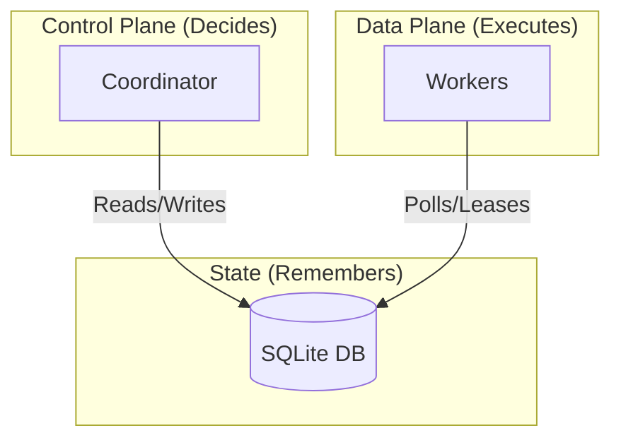

# Distributed Workflow Engine (PoC)

## 📖 Overview

This project builds a **custom distributed workflow engine** from first principles. It demonstrates how to architect a **robust, scalable, and failure-tolerant orchestration system** without relying on heavy external frameworks (like Temporal or Cadence).

**Note**: To demonstrate the engine, the project simulates a **Video Processing Pipeline** (validation → metadata → thumbnail → encode). However, the "jobs" are effectively dummy workloads designed to exercise the control plane, demonstrating how the system handles orchestration, state management, and failure recovery.

## 🏗️ Architecture

The system follows a strict **Control Plane vs. Data Plane** separation:



### 🧠 The Mental Model

> **Workers execute. Coordinators decide. Databases remember. Queues notify.**

1.  **Coordinator (Control Plane)**:
    *   The "Brain". It holds the workflow definition (the DAG).
    *   It **reconciles** the world: "I see job A succeeded, therefore job B should exist."
    *   It is stateless and crash-safe. It can be restarted at any time without losing workflow progress.

2.  **Workers (Data Plane)**:
    *   The "Muscle". They are completely unaware of the larger workflow.
    *   They ask: "Is there any `pending` job I can lease?" -> Execute -> Write Result -> Die/Repeat.
    *   They verify their **lease** before doing work and before saving work.

3.  **SQLite (State Store)**:
    *   The single source of truth.
    *   We use specific columns (`state`, `lease_owner`, `lease_expires_at`) to manage concurrency, avoiding distributed locks entirely.

### 🛡️ Core Reliability Patterns

#### 1. Leases > Locks
Distributed locks are dangerous (what if the owner dies while holding the lock?).
Instead, we use **time-limited leases**.
*   Worker: `UPDATE jobs SET owner='me', expires=NOW()+10s WHERE state='pending'`
*   Coordinator: `UPDATE jobs SET state='pending', owner=NULL WHERE expires < NOW()`
*   **Result**: If a worker crashes, the job automatically becomes available again after 10s. No manual intervention needed.

#### 2. Idempotency is Mandatory
Since we rely on retries and lease expirations, a job might execute twice (e.g., worker A hangs, lease expires, worker B picks it up, both finish).
*   **Requirement**: Jobs must handle duplicate execution safely.
*   **Implementation**: Deterministic output paths (e.g., `s3://bucket/job_id/output.mp4` rather than `s3://bucket/output_timestamp.mp4`).

#### 3. Deterministic Identity
How do we ensure the Coordinator doesn't create "Encode Job B" five times if it crashes whilst updating the DB?
*   **Solution**: Deterministic IDs.
*   `ChildJob_ID = hash(ParentJob_ID + "encode")`
*   The DB enforces uniqueness on `id`. The Coordinator can try to insert the child job 100 times; only the first succeeds.

#### 4. Reconcilation Loop
The Coordinator works like **Kubernetes Controller**, not an imperative script.
```text
Loop:
  1. Scan for completed jobs that haven't triggered downstream steps yet.
  2. "Expand" them (calculate next steps).
  3. Insert next steps (idempotent).
  4. Mark current job as 'expanded'.
```
This means the Coordinator can crash mid-loop and recover perfectly on restart.

## 🛠️ Tech Stack

- **Language**: Go
- **Database**: SQLite (modernc.org/sqlite - pure Go)
- **Storage**: Local filesystem (simulating object storage)
- **Infrastructure**: Simple process-based (run via Makefile)

## 🚀 Getting Started

### Prerequisites
- Go 1.25+

### Running the System

1.  **Seed the Database**
    Initialize the database and insert some initial jobs.
    ```bash
    make seed-db
    ```

2.  **Start the Coordinator**
    The coordinator manages the workflow state, reaping expired leases and creating downstream jobs.
    ```bash
    make run-coordinator
    ```

3.  **Start Workers**
    Start one or more workers to process the jobs.
    ```bash
    # Terminal 2
    make run-worker-1

    # Terminal 3 (Optional)
    make run-worker-2
    ```

4.  **Reset**
    To clear the database and start over:
    ```bash
    make reset-db
    ```

### Running Tests
```bash
make test
```

## 🧩 Workflow Model

The workflow is an implicit DAG hardcoded in the coordinator.
Default flow: `validate` → `metadata` → `thumbnail` → `encode`

1.  **Job Created**: Use `seed.go` or manual insert.
2.  **Pending**: Coordinator identifies it.
3.  **Running**: Worker acquires lease.
4.  **Success**: Worker updates state; Coordinator sees success and creates next job in chain.

## 💥 Proven Failure Scenarios

This architecture handles the following failures *by design*:

| Failure Mode | Resilience Mechanism |
| :--- | :--- |
| **Worker Crash** (SIGKILL) | Lease expires → Job reclaimed by another worker. |
| **Worker Hang** (Infinite loop) | Lease verifies timeout → Job reclaimed. |
| **Coordinator Crash** | System pauses. Restart resumes reconciliation loop. No state lost. |
| **Zombie Process** (Old worker wakes up) | It tries to update job, DB rejects because lease ID changed. |
| **Network Partition** | Worker can't renew lease → commits suicide or fails update. Safe. |

## 🗺️ Mapping to Production Systems (Temporal)

This PoC effectively re-implements the core primitives of modern workflow engines like **Temporal.io**.

| Our PoC Concept | Temporal / Cadence Concept |
| :--- | :--- |
| `Job` Table | Workflow Execution History |
| `Coordinator` | Temporal Server (Matcher/History Service) |
| Worker Polling | Task Queue Polling |
| Leases | Activity Start-To-Close Timeouts |
| Deterministic ID | Workflow ID reuse policy / Idempotency |
| Implicit DAG | Workflow Code (in SDK) |

**Key Insight**:
> "A system that can scale is more important than a system that does scale."

> "Workers execute. Coordinators decide. Databases remember. Queues notify."

## 📄 License
[MIT](LICENSE)
